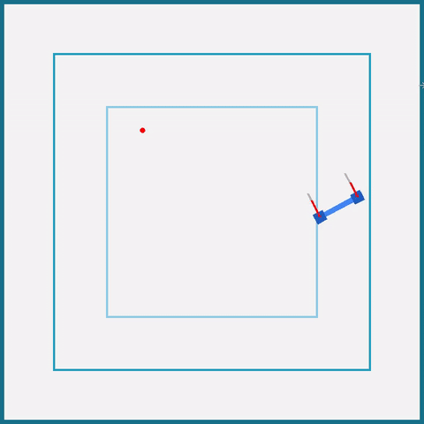
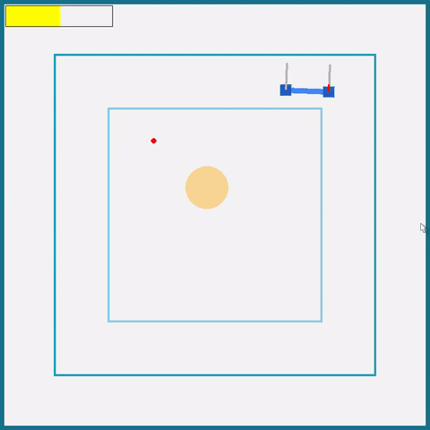
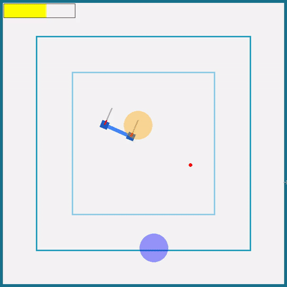
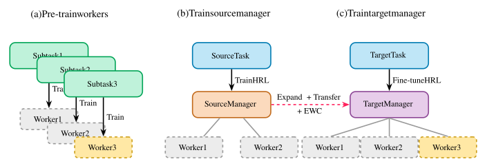

# Code for Paper "Preserving Safety While Learning New Skills: A Transfer Approach for Hierarchical RL"

This repository contains the code for the paper "Preserving Safety While Learning New Skills: A Transfer Approach for Hierarchical RL". The code is implementing the proposed safe hierarchical transfer approach using Elastic Weight Consolidation (EWC). It allows training and evaluating agents on a custom 2D drone simulation.

The primary goal of this repository is for reviewers to verify the reproducibility of the experiments presented in the paper. If the paper is accepted, the code will be open-sourced to the community.

<table style="display: table; margin-left: auto; margin-right: auto;">
  <tr>
    <td align="center" valign="top" width="33%">
      <b>Worker Task: Reach Goal</b><br>
      <code>Drone2dEnv</code>
    </td>
    <td align="center" valign="top" width="33%">
      <b>Source Task: Manage Battery</b><br>
      <code>Drone2dBudgetEnv</code><br>
      <code>Drone2dBudgetHierarchyEnv</code>
    </td>
    <td align="center" valign="top" width="33%">
      <b>Target Task: Deliver Package</b><br>
      <code>Drone2dBudgetPackageEnv</code><br>
      <code>Drone2dBudgetPackageHierarchyEnv</code>
    </td>
  </tr>
  <tr>
    <td align="center">
       <!-- Revert to fixed width -->
    </td>
    <td align="center">
       <!-- Revert to fixed width -->
    </td>
    <td align="center">
       <!-- Revert to fixed width -->
    </td>
  </tr>
</table>

<p align="center">
  
</p>

## Table of Contents

- [Installation](#installation)
- [Usage](#usage)
    - [Visualize trained policies](#visualize-trained-policies)
    - [Retrain from scratch](#retrain-from-scratch)
- [Repository Structure](#repository-structure)

## Installation

### Prerequisites

- Operating system: Linux (tested on Ubuntu 20.04 and Rocky Linux 8.4), should work on Windows and Mac OS.
- Python version: tested with Python 3.12.3 but other versions of Python 3.X should work.
- Package Manager: Pip

### Setup

#### Using Pip (optionally with Venv)

```bash
# Download the repository (anonymous git doesn't handle cloning) and extract it
# You can also manually download it by clicking Download Repository
curl https://anonymous.4open.science/api/repo/safe_hierarchical_transfer/zip --output safe_transfer.zip
unzip safe_transfer.zip -d safe_transfer/
rm safe_transfer.zip

# (Optional) Create and activate the virtual environment
python -m venv safe_transfer_venv
source safe_transfer_venv/bin/activate

# Navigate to the repository folder
cd safe_transfer/

# Install the package (optionally as editable)
pip install -e .
```

## Usage

Experiments are run using the `train_*.py` and `visualize_*.py` scripts. Configuration is primarily done via command-line arguments using the library `tyro`. Environment-specific parameters are passed using the `--env.` prefix (for example `--env.n_steps 2000` or `--env.render_path False`).

### Visualize trained policies

We provide policies for each of the three environments: `Drone2dEnv` (worker), `Drone2dBudgetHierarchyEnv` (source manager) and `Drone2dBudgetPackageHierarchyEnv` (target manager) in the [checkpoints](checkpoints/) folder.

To visualize the behavior of these policies, one can use the following commands.

**Visualize the worker policy:**
```bash
python visualize_continuous.py  \
    --env_id Drone2D-v0 \
    --num_episodes 10 \
    --model_path checkpoints/worker.pt
```
> You can change the location of the red target point with a left click

**Visualize the source manager policy:**
```bash
python visualize_discrete.py \
    --env_id Drone2D-budget-hierarchical-v0 \
    --model_path checkpoints/source_manager.pt \
    --num_episodes 10 \
    --env.env_ids '["Drone2D-v0", "Drone2D-v0"]' \
    --env.low_level_policies_paths '["checkpoints/worker.pt","checkpoints/worker.pt"]'
```
> You can change the location of the red target point with a left click, and the battery with a right click

**Visualize the target manager policy:**
```bash
python visualize_discrete.py \
    --env_id Drone2D-budget-package-hierarchical-v0 \
    --model_path checkpoints/target_manager.pt \
    --num_episodes 10 \
    --env.env_ids '["Drone2D-v0", "Drone2D-v0", "Drone2D-v0"]' \
    --env.low_level_policies_paths '["checkpoints/worker.pt","checkpoints/worker.pt","checkpoints/worker.pt"]'
```
> You can change the location of the red target point with a left click, the battery with a right click and the package with a middle click.

### Retrain from scratch

#### 1. Worker Pre-training

This step trains the low-level worker policy responsible for basic navigation. This policy uses continuous actions.

```bash
python train_continuous.py \
    --env-id Drone2D-v0 \
    --total-timesteps 200_000_000 \
    --seed 0 \
    --exp-name worker_training
```

*   This will save checkpoints in `runs/Drone2D-v0/worker_training__[your_seed]__[timestamp]/checkpoints/`.
*   Identify the final checkpoint. We will refer to this path as `checkpoints/worker.pt`.

#### 2. Source Manager Training

This step trains the high-level manager policy for the source task (e.g., "Reach Goal + Manage Battery"). This policy uses discrete actions to select between pre-trained workers.

```bash
python train_discrete.py \
    --env-id Drone2D-budget-package-hierarchical-v0 \
    --env.low_level_policies_paths '["checkpoints/worker.pt","checkpoints/worker.pt"]' \
    --env.env_ids '["Drone2D-v0", "Drone2D-v0"]' \
    --total-timesteps 50_000_000 \
    --seed 0 \
    --exp-name source_manager_training
```

*   This script loads the pre-trained worker(s) specified by `--env.low_level_policies_paths`. Note that the paths and corresponding training env IDs (`--env.env_ids`) must be provided as string representations of Python lists.
*   This will save checkpoints in `runs/Drone2dBudgetHierarchyEnv/source_manager_training__[your_seed]__[timestamp]/checkpoints/`.
*   Identify the final checkpoint. We will refer to this path as `checkpoints/source_manager.pt`.

#### 3. Target Manager Training with EWC

This step trains the high-level manager policy for the target task (e.g., "Deliver Package + Manage Battery"), transferring knowledge from the source manager and using EWC to preserve safety.

```bash
python train_discrete.py \
    --env-id Drone2D-budget-package-hierarchical-v0 \
    --env.low_level_policies_paths '["checkpoints/worker.pt","checkpoints/worker.pt","checkpoints/worker.pt"]' \
    --env.env_ids '["Drone2D-v0","Drone2D-v0","Drone2D-v0"]' \
    --total-timesteps 50_000_000 \
    --seed 0 \
    --pretrained-model-path checkpoints/source_manager.pt \
    --pretrained-env-id Drone2D-budget-hierarchical-v0 `# Env ID the source manager was trained on` \
    --ewc `# Enable EWC` \
    --ewc-lambda 1e6 `# Lambda coefficient for EWC penalty` \
    --exp-name target_manager_transfer_ewc
```

*   This script loads the pre-trained *source manager* (`--pretrained-model-path`) and the *workers* (`--env.low_level_policies_paths`).
*   Crucially, it specifies the environment the source manager was trained on (`--pretrained-env-id`) to ensure correct network expansion.
*   It enables EWC (`--ewc`) and sets the EWC penalty weight (`--ewc-lambda`).
*   Checkpoints are saved in `runs/Drone2dBudgetPackageHierarchyEnv/target_manager_transfer_ewc_[lambda_value]__[your_seed]__[timestamp]/checkpoints/`.

### 4. Evaluation and Visualization

Use the `visualize_discrete.py` script to evaluate trained managers or `visualize_continuous.py` for workers or non-hierarchical baselines.

**Visualize a trained manager (Target Task):**

```bash
python visualize_discrete.py \
    --env-id Drone2D-budget-package-hierarchical-v0 \
    --env.low_level_policies_paths '["checkpoints/worker.pt","checkpoints/worker.pt","checkpoints/worker.pt"]' \
    --env.env_ids '["Drone2D-v0","Drone2D-v0","Drone2D-v0"]' \
    --model-path checkpoints/target_manager.pt \
    --num-episodes 5
```

*   This command runs the target manager in the package delivery environment for 5 episodes with rendering.
*   The agent uses the specified worker policies.

**Evaluate a trained manager (Target Task) and save results:**

```bash
python visualize_discrete.py \
    --env-id Drone2D-budget-package-hierarchical-v0 \
    --env.low_level_policies_paths '["checkpoints/worker.pt","checkpoints/worker.pt","checkpoints/worker.pt"]' \
    --env.env_ids '["Drone2D-v0","Drone2D-v0","Drone2D-v0"]' \
    --model-path checkpoints/target_manager.pt \
    --num-episodes 50 \
    --eval `# Enable evaluation mode (no render, saves CSV)`
```

*   This runs 50 episodes without rendering.
*   Performance metrics (return, steps, termination reason - crash/ruin/truncated, etc.) are saved to `evaluation_results_Drone2dBudgetPackageHierarchyEnv.csv`.

## Repository Structure

```
.
├── README.md
├── setup.py                    # Installation script
├── checkpoints/                # Trained model checkpoints
│   ├── worker.pt               # Pre-trained worker model
│   └── source_manager.pt       # Pre-trained source manager model
├── src/
│   └── safe_transfer/          # Main package source code
│       ├── __init__.py
│       ├── environments/       # Custom Gymnasium environments
│       │   ├── __init__.py
│       │   ├── drone.py        # Drone physics components
│       │   ├── drone_2d.py     # Base 2D drone environment
│       │   ├── drone_2d_budget.py # Drone env with battery budget
│       │   ├── drone_2d_budget_package.py # Drone env with budget and package delivery
│       │   ├── drone_2d_hierarchical.py # Hierarchical wrappers for budget/package envs
│       │   ├── utils.py        # Environment utility functions
│       │   └── img/            # Images for rendering
│       │       ├── icon.png
│       │       └── shade.png
│       ├── ewc.py              # Elastic Weight Consolidation implementation
│       ├── nn.py               # Neural network definitions (AgentDiscrete, AgentContinuous)
│       └── parser.py           # Custom argument parser for --env flags
├── train_continuous.py         # Script for training continuous policies (workers and non-hierarchical baselines)
├── train_discrete.py           # Script for training discrete policies
├── visualize_continuous.py     # Script for visualizing/evaluating continuous policies
└── visualize_discrete.py       # Script for visualizing/evaluating discrete policies
```